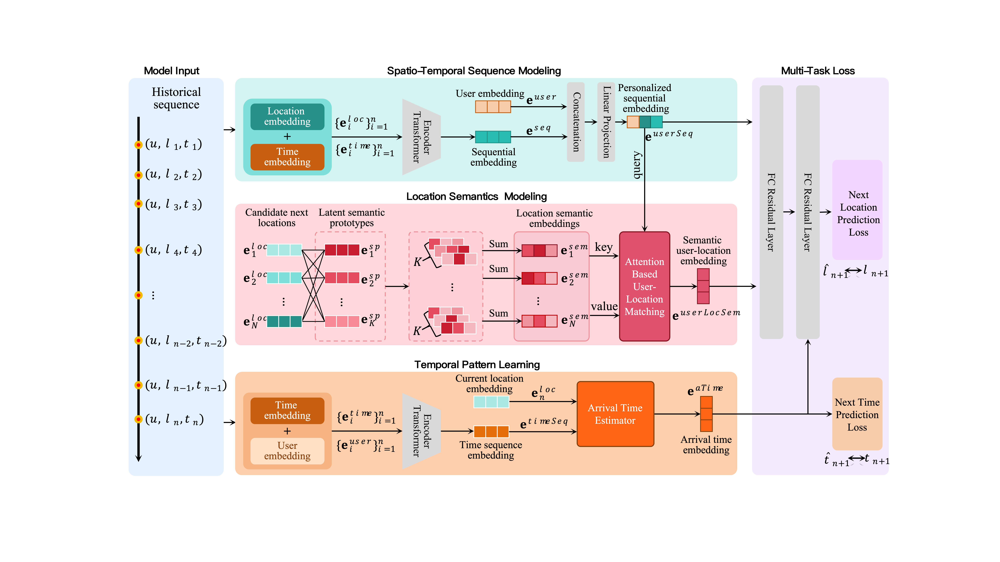

# STEP
This is the PyTorch implementation of the Semantic and Temporal Enhanced Prediction model (STEP) and helps readers to reproduce the results in the paper "**Next Location Prediction with Latent Location Semantics and Activity Time Inference**".

* Model Framework
<p align="middle" width="100%">
  
</p>

### Configurations
For TC datasets, the embedding dimensions of the proposed model are set to 32, while for MP, it's 16.  
The Transformer encoder consists of 2 layers, each with 4 attention heads and a dropout rate of 0.1.  
We train STEP for 50 epochs with a batch size of 128. 

### Requirements
The runtime environment can be viewed in requirements.txt or by executing the following command:
```shell
pip install -r requirements.txt
```

### Hyperparameters
All hyperparameter settings are saved in the `.yml` files under the respective dataset folder under `saved_models/`. \
\
For example, `saved_models/TC/settings.yml` contains hyperparameter settings of MCLP for Traffic Camera Dataset. 

### Run
#### The following is a run of Traffic Camera Dataset (Mobile Phone Dataset is similarly provided):
- Unzip `data/TC.zip` to `data/TC`. The two files are training data and testing data.

- For STEP model:
  ```shell
  python ./model/run.py --dataset TC --dim 32 
  ```


